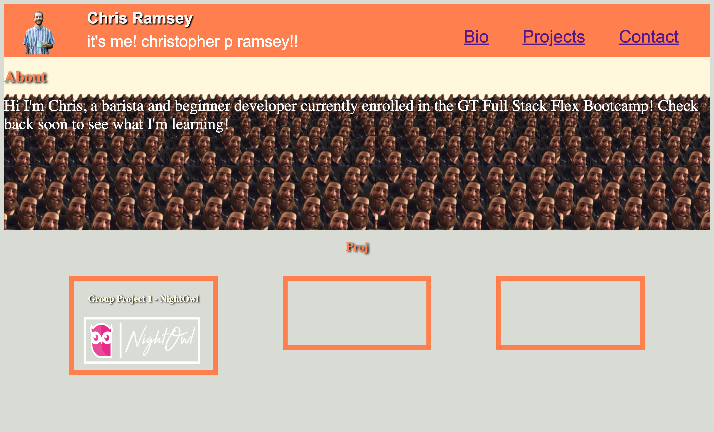

# The-Portfolio-Of-Christopher-Paul-Ramsey

# Project Description

Create, from scratch, a portofolio to showcase what I've learned and will continue to learn in this bootcamp.

## Content 

1. [Deployed Webpage](#deployed-webpage)
2. [Action Taken](#action-taken)

## Deployed Webpage

[Deployed Webpage](https://c-ramsey.github.io/the-portfolio-of-christopher-paul-ramsey/)

## Screenshot

## Action Taken

* Created wireframe to visualize webpage layout
* Wrote and structured html to match wireframing 
* Made class assignments in html for styling 
* Styled webpage using css concepts learned in first 2 modules 
